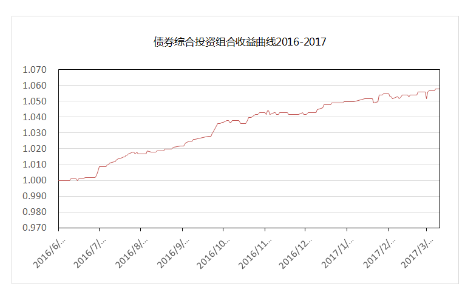

#债券综合投资策略

## 1. 策略简介

本基金将采取利率策略、信用策略、债券选择策略等积极投资策略，在严格控制风险的 前提下，发掘和利用市场失衡提供的投资机会，以实现组合增值的目标。   

（1）利率策略: 通过全面研究 GDP、物价、就业以及国际收支等主要经济变量，分析宏观经济运行的可能情景，并预测财政政策、货币政策等宏观经济政策取向，分析金融市场资金供求状况变化趋势及结构。在此基础上，预测金融市场利率水平变动趋势，以及金融市场收益率曲线斜度变化趋势。组合久期是反映利率风险最重要的指标。本基金将根据对市场利率变化趋势的预期，制定出组合的目标久期：预期市场利率水平将上升时，降低组合的久期；预期市场利率将下降时，提高组合的久期。  

（2）信用策略:根据国民经济运行周期阶段，分析企业债券、公司债券等发行人所处行业发展前景、业务发展状况、市场竞争地位、财务状况、管理水平和债务水平等因素，评价债券发行人的信用风险，并根据特定债券的发行契约，评价债券的信用级别，确定企业债券、公司债券的信用风险利差。债券信用风险评定需要重点分析企业财务结构、偿债能力、经营效益等财务信息，同时需要考虑企业的经营环境等外部因素，着重分析企业未来的偿债能力，评估其违约风险水平。 

（3）债券选择策略:根据单个债券到期收益率相对于市场收益率曲线的偏离程度，结合其信用等级、流动性、选择权条款、税赋特点等因素，确定其投资价值，主要选择定价合理或价值被低估的企业（公司）债券进行投资。
具有以下一项或多项特征的债券，将是本基金重点关注的对象：

	1. 利率预期策略下符合久期设定范围的债券；
	2. 资信状况良好、未来信用评级趋于稳定或有较大改善的企业发行的债券；
	3. 在信用评级等因素基本一致的前提下，高债息的债券；
	4. 在剩余期限和信用等级等因素基本一致的前提下，运用收益率曲线模型或其他相关估值模型进行估值后，市场交易价格被低估的债券；
	5. 公司基本面良好，具备良好的成长空间与潜力，转股溢价率和投资溢价率合理、有一定下行保护的可转债；
	6. 在合理估值模型下，预期能获得较高风险－收益补偿且流动性较好的资产支持证券。

（4）可转换债券投资策略:可转换债券兼具权益类证券与固定收益类证券的特性。本基金将选择公司基本素质优良、其对应的基础证券有着较高上涨潜力的可转换债券进行投资，并采用期权定价模型等数量化估值工具评定其投资价值，以合理价格买入并持有。本基金持有的可转换债券可以转换为股票。   

（5）资产支持证券等品种投资策略:包括资产抵押贷款支持证券（ABS）、住房抵押贷款支持证券（MBS）等在内的资产支持证券，其定价受多种因素影响，包括市场利率、发行条款、支持资产的构成及质量、提前偿还率等。本基金将深入分析上述基本面因素，并辅助采用蒙特卡洛方法等数量化定价模型，评估其内在价值。

