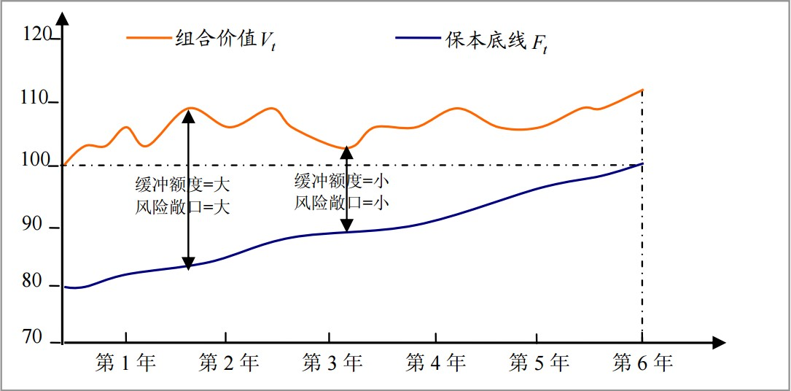
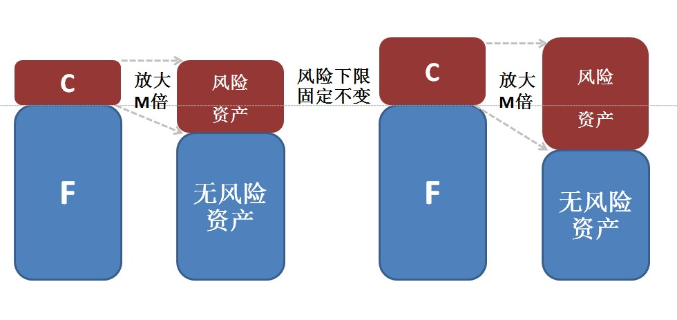
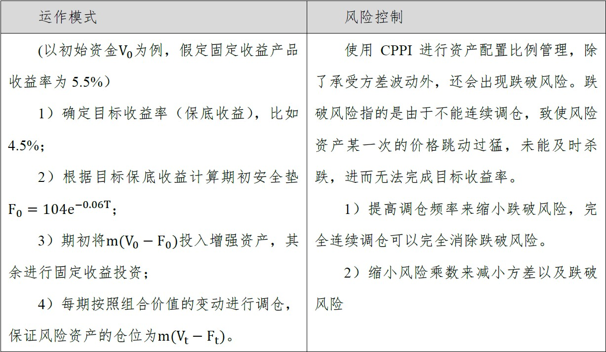
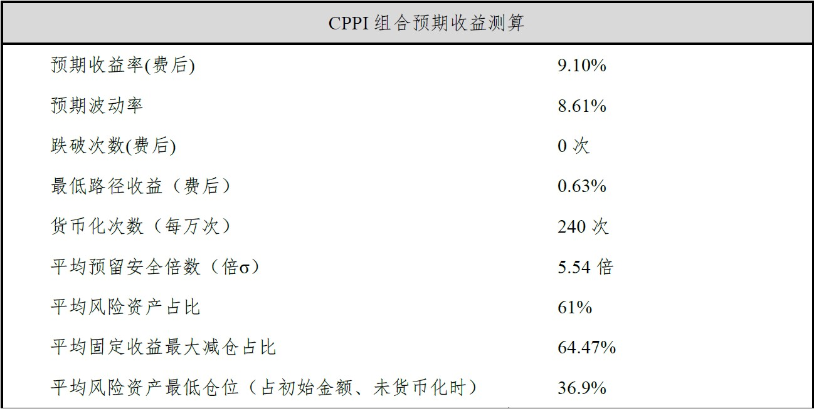

#CPPI策略介绍

## 1. 策略简介

CPPI（固定比例投资组合保险策略）是通过固定风险乘数，以保护目标收益率为首要条件，根据增强资产的波动动态调整增强资产和固定收益资产的投资比例，进行追涨杀跌，向下控制风险，向上博取收益。

Black & Jones (1986)提出了固定比例投资组合保险策略(Constant Proportion Portfolio Insurance，CPPI)，利用该策略进行组合保险，投资者必须确定受保组合的当现价值与到期日要保额度的现值之间的差额为预定所能承受的风险损失，依据投资者风险偏好及风险资产性质来选择风险参数，通过下述步骤来动态调整风险资产及无风险资产的部位，来达到投资组合保险的目的。

 

 

CPPI 策略操作方式:  

1. 计算缓冲额度（Ct）： Ct = Vt - Ft；  
2. 计算投资风险敞口： Et = m × Ct = m × (Vt - Ft)；  
3. 加入借贷限制，Et = min(m × Ct，Vt)，即当上一步计算出的Et大于Vt时，不再对外融资，而是将Vt全数投资于风险性资产；  
4. 计算投资于无风险资产的部位： Bt = Vt - Et 。    

CPPI需要有程序化投资系统作支持，按照上述策略动态分配风险资产和无风险资产的比例，只要风险资产在调整之前未发生超过1/m的跌幅，则组合价值不会跌破要保额度。  

当风险乘数m>1时，CPPI策略与复制卖权策略一样，其图形都是属于凹性（Convex）的函数型态，其操作的手法属于“买高卖低”的方式；   
当风险乘数o<m<1时，CPPI策略与恒定混合策略（Constant Mix Strategy, CM）相同：投资于风险资产的部位固定维持为投资组合的资产总值的一定比例，CM策略为“买低卖高”操作策略，在反转盘整的行情时，其投资组合的绩效会最好。  
当风险乘数m=1时，CPPI 策略与买入持有策略（Buy and Hold Strategy, B-H）相同：将与按无风险利率贴现的本金相等的资金投资于无风险资产，余下的资金（缓冲额度）投资于风险资产以产生额外的回报。在买入持有策略之下，投资者可以维持一个最低的报酬率不受侵蚀，同时又可以享受投资于股票市场的增值利益，故期初投资于风险性资产的比率越高，可享受的增值利益亦越高，但相对的能保障的要保金额也就越低，至于如何取舍视投资者对风险的容忍度和风险偏好而定。

## 2.资产选择

CPPI 将大部分资金用于投资固定收益产品，如固定利率债券或者债券型基金，部分可投资于风险较高的品种，要想在损失下限较小的情况下获得较高的回报，剩余的资金必须投资于风险较高的品种，最好是具有“杠杆效应”的投资工具。风险资产可基于如下资产类别：股票、股票指数、交易策略、商品、商品指数、债券指数、基金、期货等。CPPI 风险资产的挑选基于资产增长率和投资者面貌。总的来说，资产需要流动性较强，价格公开，便于交易，当市场出现大的震荡时，流动性是有效止损的保障。在衡量资产的市场流动性时，一般从以下四个方面进行考虑：  

1. 宽度，宽度指标从价格方面衡量市场流动性，反映了市场参与者的交易成本，市场参与者更愿意交易成本低廉的资产，主要有买卖价差、价格改善指标、方差比率等指标；
2. 深度，是指在不改变市场价格的情况下可能的交易量，主要包括报价深度、成交深度、成交量、持仓量等指标；
3. 速度，从即时性角度定义流动性，主要包括交易执行的等待时间、成交频率等指标；
4. 弹性，指由于非对称信息驱动的交易引起的价格波动回归均衡价格的速度, 弹性越大流动性越好,同时也说明市场的效率越高。

 

## 3.友山CPPI介绍

友山CPPI策略主要由精选的私募基金池作为风险资产，而无风险资产择由底层固定收益资产和高流动性固定收益资产两部分组成。  
CPPI策略需要在期初对初始运作参数进行设置和调校。需使用风险资产收益属性、固定收益类资产收益属性、以及策略预期效果（保本线，波动率，跌破风险控制等）对期初参数进行调校。

方案测试数据：  
在本次方案测算中，我们选择了四个策略类别的私募基金进行配置风险资产，策略类别分别为股票多头、量化对冲、CTA以及多策略，四只基金相关性相对较低。我们使用了过往数据对风险资产收益属性进行了测算，并构建投资组合。组合收益属性见下表：  

|区间收益|下行风险|最大回撤|夏普比例|Sortino比例| 1% Quantile |
|-------|-------|-------|-------|-------|-------|
| 14.84% | 2.33% |-7.89% | 3.37% | 5.88% | -0.50% |

无风险资产则分为底层固定收益资产和高流动性固定收益资产两部分。其中，高流动性资产主要投资于短期限AAA级同业存单，在调仓前一交易日预估调仓头寸并进行交易；底层固定收益资产投资于1年期短融或6个月期限同业存单，所有底层资产头寸持有到期。目前短期限AAA存单收益率约为4.6%，短融和6个月左右期限存单价格为4.9%。  

测算采用了上述初始参数设置，使用蒙特卡洛模拟对CPPI组合表现进行了测算，分别对组合的预期收益、预期波动率、跌破风险（每10000次模拟中发生本金亏损的次数）、跌破后平均亏损值（expected shortfall）、最大亏损情况进行了分析，并且对可预期收益概率进行了测算。

从测算结果看，组合平均可实现费后收益9.1%，预期波动率为8.61%，在10000次测试中，240次发生货币化，0次发生本金亏损，最差一次获得费后收益0.63%。  

以下为CPPI2016-2017历史数据回测，组合回测数据波动明显小于同期沪深300指数，期间年化收益达到8.12%，年化波动率为2.11%，最大回撤为-1.07%，夏普比例为3.98.

