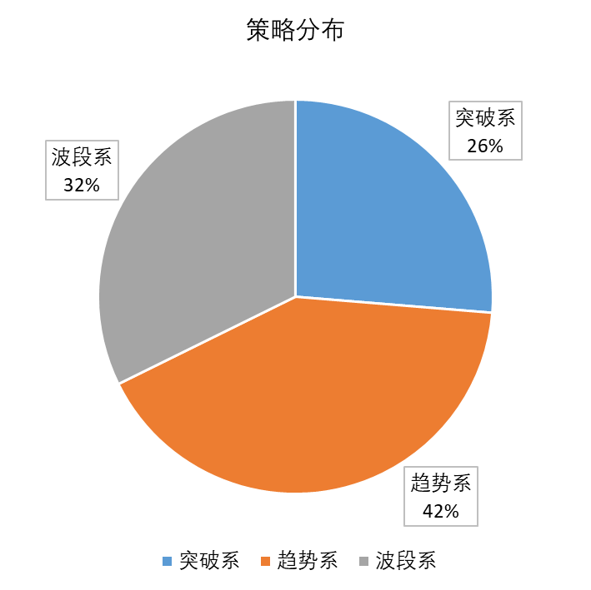

# CTA综合策略

## 1. 策略简介

- CTA量化策略主要包括：趋势追踪、趋势反转、区间震荡、均值回归等，其中尤以趋势追踪最为常用  

- 均值回归追求高胜率，虽然单笔交易收益率并不高，但可以广泛应用于跨期、跨品种配对交易，有利于扩大交易范围  

- 由于大宗商品价格运行的内在机制，趋势追踪往往能取得非常显著的正收益，而且期货交易可以采用多空策略来进一步扩大交易机会  

- Hurst, Yao and Pedersen (2014)证明了趋势投资法是普世的，在不同的年代不同的资产类别不同的经济周期下都是合适的  

  

  

- 趋势追踪策略的收益高度依赖于趋势的持续时间和累积波幅，特点是亏小钱、挣大钱，通过程序交易严格的交易纪律来保证
- 利润锁定主要依靠保本指令，即首次穿越指定价格激活指令，反向二次穿越时触发自动平仓，触发价格由算法浮动给定
- 止损和止盈算法综合多种技术指标进行优化，对伪信号干扰进行一定过滤，保证头寸有效停留时间，指标集包括但不限于平均真实波幅（ATR）等

  

  

- CTA整体调整效果：从2006~2016年，除2008年外，都可在不牺牲较大收益的情况下平滑资金曲线，盈亏比有明显提升，收益率最大回撤比有明显提升。
- 2016年按照板块进行调整：黑色牺牲了大幅的收益；化工品和农产品改善效果有限；有色有较大改善。
- 该调整方法在极端单边行情中会牺牲收益，更有效的手段是直接对整体仓位进行调整，目前计算的仓位应为最大仓位的60%。

|  | 原始曲线 | 调整曲线 |
|---------|-------|-----|
|盈亏比 | 1.49 | 1.71 |
|收益率 |  30.6% | 26.8% |
|最大回撤| 5.5% | 3% 
|收益率/最大回撤 | 5.6 | 8.8 

   

- 趋势追踪策略受到伪信号的干扰，在震荡市中收益不显著甚至有损失，而基于价格运行状态识别的CTA量化策略组合，可以获得更稳健的收益
- CTA主观策略基于基本面研究，同样能把握趋势性交易机会，并在震荡市中主动规避低效交易，但存在策略触发机会少、入场点偏左侧等常见问题
- CTA量化策略通过状态识别和信号提取，可以很好支持CTA主观策略，未必需要复杂的量化基本面（Quantmental），量化辅助（Quant Aid）更为有效

  

  

- 从行为金融学角度解读，趋势大体可以分为三个阶段：正常反应（under-reaction）、过度反应（over-reaction）、趋势终结
- 宏观研究团队和基本面研究团队提供额外信息，帮助CTA量化策略搜索和聚焦重点品种，提供价格运动方式的预测参考，但不干扰程序交易的实施
- 量化团队将量化信号输入动量模型，比照历史统计数据计算潜在胜率和盈亏比，相比主观策略更精准地捕捉趋势信号

  

  

- 统计数据显示，商品期货纯多头的收益归因，大约一半来自绝对价格，另一半来自展期收益；展期收益可以抵消部分价格的不利波动，但只能有限预测价格的波动方向
- 对1877~2015年的长期历史数据回测显示，在通胀上升或经济扩张时，远期贴水和升水品种均能取得显著正收益；在通胀下降或经济衰退时，远期升水品种都会出现显著负收益，尤其是经济衰退时
- 上述实证研究，为CTA量化策略的多空持仓选择提供了依据，也为全天候策略中增加商品期货配置奠定了基础

  

  

## 2.策略配置

- 品种选择中，趋势性比较明显的品种加大权重，权重配比采取动态追踪、实时调整，实现利润最大化、回撤最小化。但考虑到趋势行情只占到1/4左右，其余3/4属于震荡行情，还配有相应策略保证震荡市中有小幅盈利，以平滑净值曲线。

- 策略考虑了日内交易手续费和买卖滑点等问题，合理配置了策略频率，中周期和长周期策略超过了一半。在充分保证模型灵敏度的同时，尽量规避交易规则频繁改动对资金曲线的影响。

- 信号触发依据不同频率的K线和均线系统，2小时以内中频信号触发超过2/5。日级别和周级别的低频信号主要用于捕捉大级别机会，并不过度依赖快进快出的高频交易。

## 3.净值分析

- 以x1倍杠杆将净值标准化，2014~2017年取得了70%的累积回报，对杠杆依赖程度较低
- 在2014~2015年的商品熊市中，利用做空机制和策略优势，依然取得了30%的回报
- 在2016年底结束趋势行情，进入震荡行情后，净值回撤有效，保持在高位并有所增长
- 策略单笔交易的历史胜率在55%~60%范围内，盈亏比在1.5~2.0范围内
- 2017年最大浮盈回撤2.4%，最大基本回撤1.6%，有效保护了本金安全

