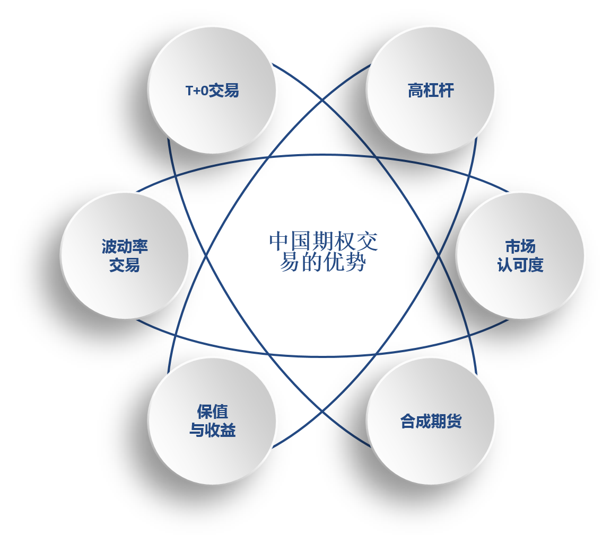
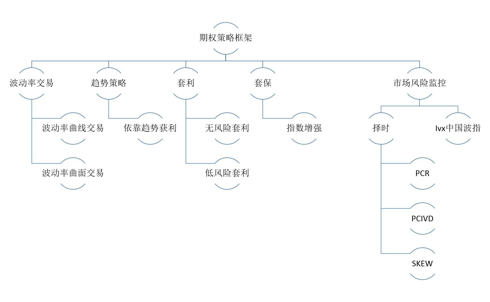

#友山期策略介绍

## 1. 策略简介

期权做为国内新上市的衍生品具有专业性与创新性的特点。它的出现打破了原有的交易维度，从原有单一的方向性维度扩展到与方向性无关的波动率交易维度。期权策略大多属于统计套利范畴，其波动率策略具有收益稳定回撤小的特点，趋势策略具有杠杆性高，到期盈亏确定性特点。期权又做为新的一种对冲工具，可以给我们提供新的策略开发思路，如50指数增强、套利等.....

友山期权策略主要由4+1组成：主要包括波动率交易，趋势交易，50指数增强，套利4个策略模块及1个风险管理模块组成。

## 2.净值分析

本策略自2016年起全年取得了37%的累计收益，最大回撤为3.77%。回测收益曲线如下图所示，其中Sharpe:3.71，年化波动率：9.26%。从净值曲线整体上分析，期权的净值符合收益稳定回撤小的特点。

