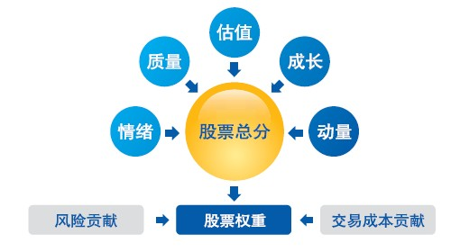
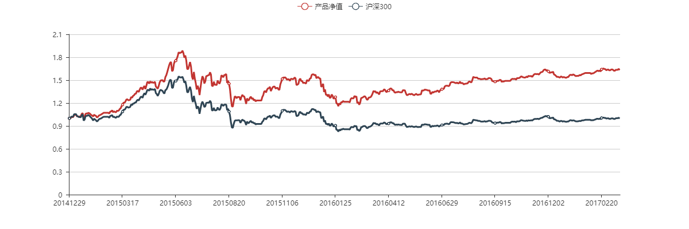

#多因子模型（指数增强）

## 1. 策略简介

多因子模型是量化选股领域应用最为广泛和成熟的方法，通过对股票收益率相关的因子进行检验和筛选，找到能够在未来一定期限内预测股票收益的特征，寻找与市场不相关的阿尔法，成为衡量一家量化基金的基本标准。随着大数据和计算机能力的跨越式发展，机器学习和人工智能技术在股票投资领域的应用不断深化，目前我司已建立了多因子和机器学习为主的两套研究框架体系，旨在不断的市场进化中，始终具备为投资者提供具有风险收益比的产品和服务。

多因子模型最为根本的方法是从舆情、估值、动量、成长、一致预期等多个方面寻找指导股票价格的前瞻性指标，并通过组合权重的优化或行业、市值等中性化的处理来减小权益的波动。

深度学习和强化学习日新月异的发展，为量化投资和智能投顾提供了多种可能。

## 2.净值分析

本产品自2014年12月30日起，取得了63%的收益，年化收益23%，相对沪深300跑赢了64%，策略本身具有稳定的跑赢大盘的能力。策略作为量化对冲还是T+0的底仓，策略均表现出优异的赢利能力。

